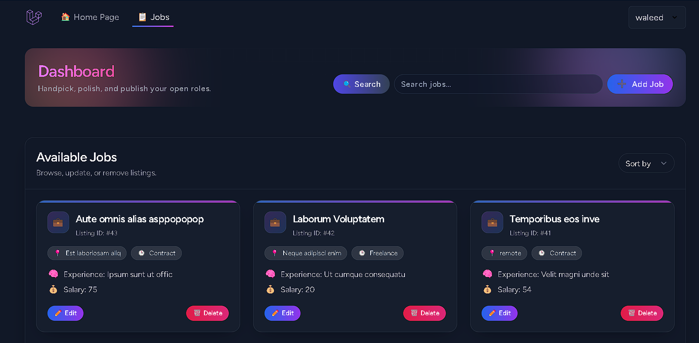

# 🚀 Laravel Job Dashboard

A clean and secure job management system built with **Laravel 12** and **Laravel Breeze**. Users can add, edit, view, and delete job listings, with full authentication and profile management out of the box.

---

## 🧰 Tech Stack

* **Laravel 10+**
* **Laravel Breeze** (Auth scaffolding)
* **Tailwind CSS** (Responsive UI)
* **Vite** (Asset bundling)
* **Blade Templates**

---

## 🔐 Authentication

* Login / Register via Laravel Breeze
* Email verification enabled
* Profile editing and password update

---

## 📦 Features

* ✅ Add new job listings
* ✅ Edit existing jobs
* ✅ View job details
* ✅ Delete jobs
* ✅ Authenticated dashboard access
* ✅ Profile management

---

## 🖼️ Screenshots

Here’s a quick look at the main sections of the Job Dashboard:

| Feature                      | Screenshot                                                      |
| ---------------------------- | --------------------------------------------------------------- |
| **Welcome Page**             |       |
| **Dashboard**                |        |
| **Dashboard**                |        |
| **Show Job Details**         |          |
| **Edit Profile**             |  |
| **Responsive (Mobile View)** |  |
| **Responsive (Mobile View)** |  |

---

## 📁 Full Route Overview

| Method | URI                                | Controller & Action                             | Name                  |
| ------ | ---------------------------------- | ----------------------------------------------- | --------------------- |
| GET    | `/`                                | Static welcome page                             | —                     |
| GET    | `/dashboard`                       | Authenticated dashboard                         | `dashboard`           |
| GET    | `/profile`                         | `ProfileController@edit`                        | `profile.edit`        |
| PATCH  | `/profile`                         | `ProfileController@update`                      | `profile.update`      |
| DELETE | `/profile`                         | `ProfileController@destroy`                     | `profile.destroy`     |
| GET    | `/jobs`                            | `JobController@index`                           | `jobs.index`          |
| GET    | `/jobs/create`                     | `JobController@create`                          | `jobs.create`         |
| POST   | `/jobs`                            | `JobController@store`                           | `jobs.store`          |
| GET    | `/jobs/{id}`                       | `JobController@show`                            | `jobs.show`           |
| GET    | `/jobs/{id}/edit`                  | `JobController@edit`                            | `jobs.edit`           |
| PUT    | `/jobs/{id}`                       | `JobController@update`                          | `jobs.update`         |
| DELETE | `/jobs/{id}`                       | `JobController@destroy`                         | `jobs.destroy`        |
| GET    | `/register`                        | `RegisteredUserController@create`               | `register`            |
| POST   | `/register`                        | `RegisteredUserController@store`                | —                     |
| GET    | `/login`                           | `AuthenticatedSessionController@create`         | `login`               |
| POST   | `/login`                           | `AuthenticatedSessionController@store`          | —                     |
| POST   | `/logout`                          | `AuthenticatedSessionController@destroy`        | `logout`              |
| GET    | `/forgot-password`                 | `PasswordResetLinkController@create`            | `password.request`    |
| POST   | `/forgot-password`                 | `PasswordResetLinkController@store`             | `password.email`      |
| GET    | `/reset-password/{token}`          | `NewPasswordController@create`                  | `password.reset`      |
| POST   | `/reset-password`                  | `NewPasswordController@store`                   | `password.store`      |
| GET    | `/verify-email`                    | `EmailVerificationPromptController` (invokable) | `verification.notice` |
| GET    | `/verify-email/{id}/{hash}`        | `VerifyEmailController` (invokable)             | `verification.verify` |
| POST   | `/email/verification-notification` | `EmailVerificationNotificationController@store` | `verification.send`   |
| GET    | `/confirm-password`                | `ConfirmablePasswordController@show`            | `password.confirm`    |
| POST   | `/confirm-password`                | `ConfirmablePasswordController@store`           | —                     |
| PUT    | `/password`                        | `PasswordController@update`                     | `password.update`     |

> These are the conventional Breeze routes. If you used Breeze with Inertia/React/Vue, URIs are the same but controllers live in the `Auth` namespace. Run `php artisan route:list` to confirm in your app.

---

## 🚀 Getting Started

```bash
# 1) Clone and install dependencies
git clone https://github.com/username/job-dashboard.git
cd job-dashboard
composer install
npm install

# 2) Environment
cp .env.example .env
php artisan key:generate

# Set your DB credentials in .env, e.g.
# DB_CONNECTION=mysql
# DB_HOST=127.0.0.1
# DB_PORT=3306
# DB_DATABASE=job_dashboard
# DB_USERNAME=root
# DB_PASSWORD=secret

# 3) Database
php artisan migrate
# (optional) php artisan db:seed

# 4) Assets (dev)
npm run dev
# (for production) npm run build

# 5) Serve
php artisan serve
```

---

## 📚 About Laravel

Laravel is a web application framework with expressive, elegant syntax. It eases common tasks like routing, dependency injection, caching, ORM, migrations, queues, and broadcasting. See the official docs for details.

* [Routing](https://laravel.com/docs/routing)
* [Service Container](https://laravel.com/docs/container)
* [Sessions](https://laravel.com/docs/session)
* [Cache](https://laravel.com/docs/cache)
* [Eloquent ORM](https://laravel.com/docs/eloquent)
* [Migrations](https://laravel.com/docs/migrations)
* [Queues](https://laravel.com/docs/queues)
* [Broadcasting](https://laravel.com/docs/broadcasting)

---

## 🎓 Learning Laravel

* [Laravel Docs](https://laravel.com/docs)
* [Laravel Bootcamp](https://bootcamp.laravel.com)
* [Laracasts](https://laracasts.com)

---

## 🤝 Contributing

Please see the [contribution guide](https://laravel.com/docs/contributions) and the community [Code of Conduct](https://laravel.com/docs/contributions#code-of-conduct).

---

## 🔐 Security

If you discover a security vulnerability in Laravel, email Taylor Otwell at **[taylor@laravel.com](mailto:taylor@laravel.com)**. Vulnerabilities are addressed promptly.

---

## 🧾 License

This project is open-sourced software licensed under the [MIT license](https://opensource.org/licenses/MIT).
